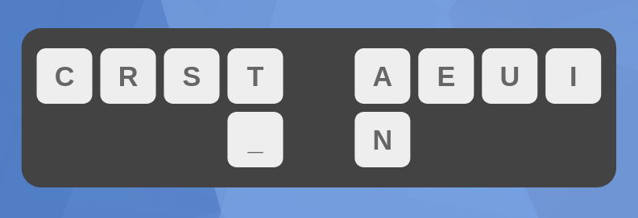
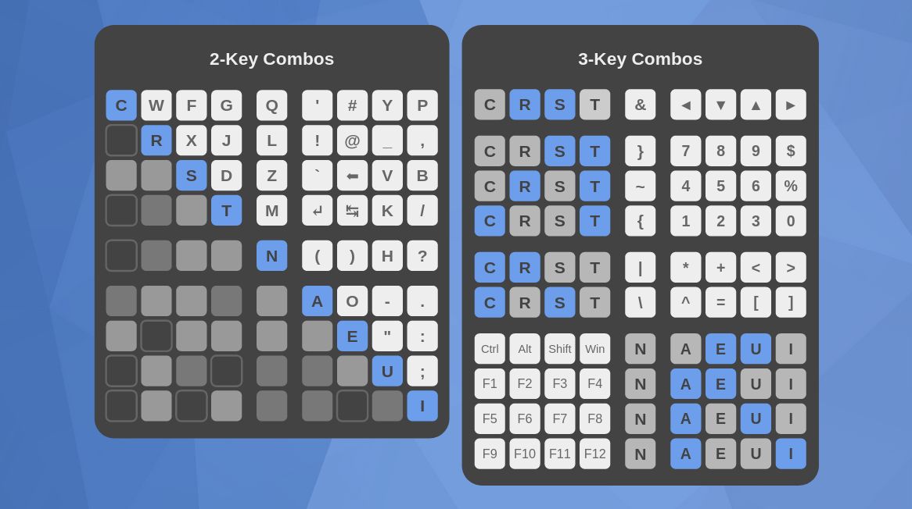

# Crescent
Crescent is a layout I designed to have no movement, no scissors, no lsbs, and minimal sfbs. It achieves this by limiting itself to just the home positions of all 10 fingers, and by using combos that were carefully selected to minimize sfbs. 

## Homerow
The home keys are CRST on the left hand, AEUI on the right hand, and N on one of the thumbs (with space on the other). These are some of the most common keys typed in English, accounting for 56% of the letters typed.

## Combos

Crescent has both two-key combos and three-key combos. The two-key combos consist of all 26 letters, all punctuation, backspace, enter, tab, and a few common symbols. These combos formed the bulk of the work to minimize sfbs when typing English texts.

Crescent also has a number of three-key combos, which contain less frequent symbols, function keys, and modifiers. You can navigate using vim-like arrow keys, type numbers and numeric operators, and use modifiers like ctrl, shift, alt, and super.

The chart above describes how to type both two-key and three key combos. For two-key combos, pick a letter, and look to the left and down. The two blue keys are the two keys that are pressed simultaneously to output that letter. The three-key combos follow a pattern of two blue keys on one hand, and one white key on the other hand. 

## Installation
Currently there is no file for this layout. I am currently working on creating one in Kanata.

## Special Thanks
- [Eve](https://github.com/Apsu), for providing inspiration for this project
- Valorance, for providing the name

## Contact
If you have any questions about this layout or keyboard layouts in general, please don't hesitate to join the [discord](https://discord.com/invite/hhQ24W5gtP).
